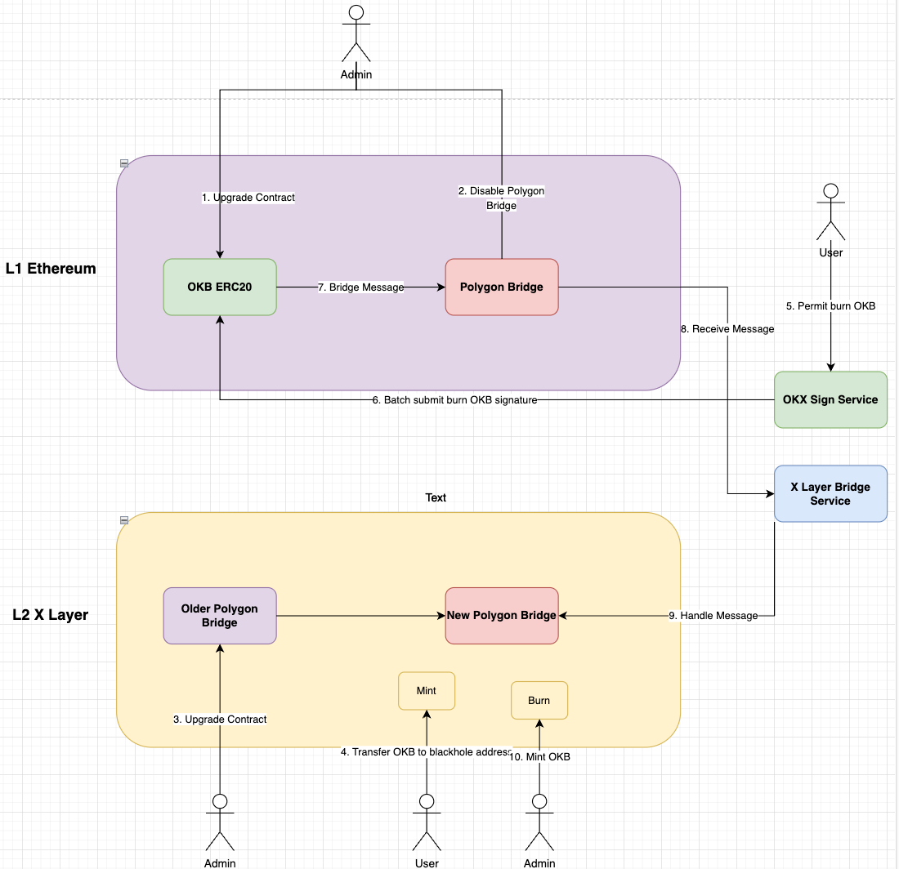
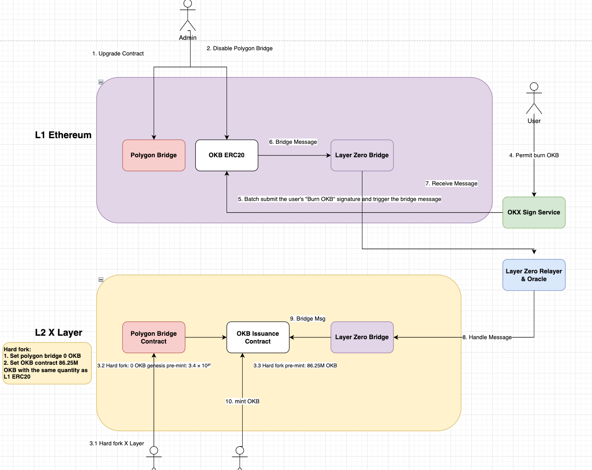

**1. Background**

The goal is to **burn OKB ERC20 tokens on Ethereum (L1)** and **mint the corresponding amount of native OKB tokens on X Layer (L2)**.

**2 Option 1: OKB Burn/Mint via Polygon Bridge Messaging**

1. **Preparation Phase:**

   1. *Steps 1 & 2:* Upgrade the OKB ERC20 contract on Ethereum (L1) and disable user ability to bridge OKB to L2 via the old Polygon Bridge.
   2. *Step 3:* On X Layer (L2), upgrade the old Polygon Bridge to a new version that supports mint and burn functionalities.
   3. *Step 4:* On L2, the admin sends the OKB held in the old Polygon Bridge contract to a blackhole address, retaining only **86.25M OKB**, matching the total supply on the L1 ERC20 contract.

2. **User Interaction Phase:**

   1. *Step 5:* On L1, users authorize the OKX Sign Service to burn their OKB tokens.

3. **Cross-Chain Messaging Phase:**

   1. *Step 6:* OKX Sign Service collects user burn signatures in batches and submits them to the Polygon Bridge, triggering a cross-chain message.
   2. *Step 7:* The Polygon Bridge generates a bridging message to be sent to L2.
   3. *Step 8:* X Layer Bridge Service receives the cross-chain message from L1.
   4. *Step 9:* X Layer Bridge Service passes the message to the new Polygon Bridge on L2 for processing.

4. **Completion Phase:**

   1. *Step 10:* The new Polygon Bridge mints the corresponding amount of OKB on L2, and users receive the equivalent amount of new OKB on X Layer.

**3 Option 2: Hard Fork L2 and Deploy Issuance Contract, Use LayerZero Bridge for Burn/Mint Messaging**

1. **Preparation Phase:**

   1. *Steps 1 & 2:* Admin upgrades the OKB ERC20 contract on Ethereum (L1) and disables user bridging of OKB to L2 via the old Polygon Bridge.
   2. *Step 3.1:* Admin performs a hard fork upgrade on X Layer (L2).
   3. *Steps 3.2 & 3.3:* As part of the hard fork:

      * The initial OKB balance in the old Polygon Bridge is set to zero.
      * An **OKB Issuance Contract** is deployed, pre-minting **86.25M OKB**, matching the total supply on the L1 ERC20 contract.

2. **User Interaction Phase:**

   1. *Step 4:* On L1, users authorize the OKX Sign Service to burn their OKB holdings.

3. **Cross-Chain Messaging Phase:**

   1. *Step 5:* OKX Sign Service batches user burn signatures and submits them, triggering LayerZero Bridge to generate a cross-chain message.
   2. *Step 6:* LayerZero Bridge sends the message to L2.
   3. *Step 7:* LayerZero Relayer & Oracle receive the cross-chain message from L1.
   4. *Step 8:* LayerZero Bridge on L2 processes the received message.
   5. *Step 9:* The processed message is forwarded to the OKB Issuance Contract.

4. **Completion Phase:**

   1. *Step 10:* The OKB Issuance Contract mints the corresponding amount of OKB, and users receive the new OKB on X Layer (L2).
